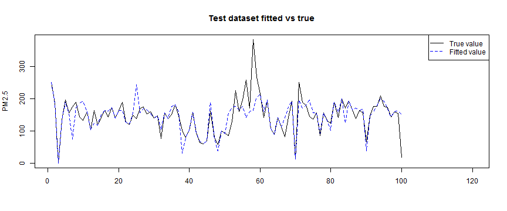
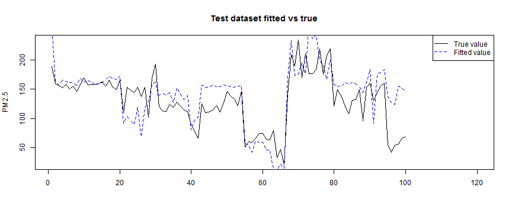
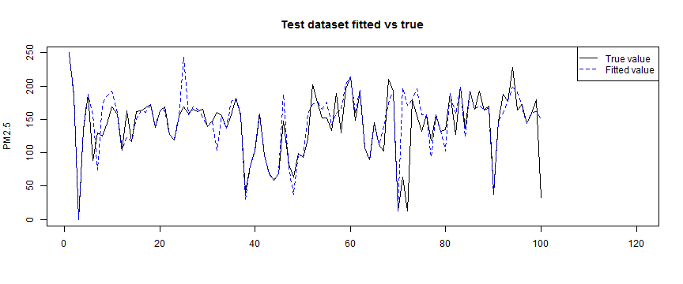
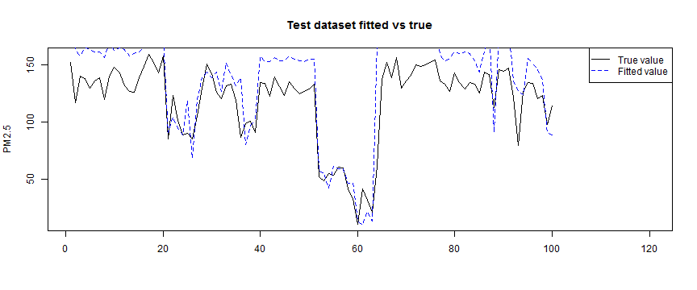

Weighted k-Nearest Neighbor is used to model the air pollution data. PM2.5 is predicted with the k nearest training set vectors (according to Minkowski distance). Kernel functions are used to weight the neighbors according to their distances.  
Both location and time are considered as features in this model. Actually, this model is similar to some space and time series model in some condition. This model can also serve as a smooth algorithm by space and time.
<p>

##Step 1: Preprocessing
*UMT_time* is converted to timestamp(POSIXct). Also, subsetting by time and space can be done for further analysis.

```r
#import the datase
total_data<-read.csv('./data/airdata.csv', encoding = 'UTF-8')
#convert UMT_time to timestamp
total_data$UMT_time<-as.numeric(as.POSIXct(as.character(total_data$UMT_time), format = "%Y%m%d%H%M%S"))
#convert to numeriec
total_data[,c(6:13,15,16)]<-sapply(total_data[,c(6:13,15,16)] , function(x){as.numeric(as.character(x))})
```

```r
#subset
subarea_data<-total_data[total_data$Latitude>35&total_data$Latitude<40&total_data$Longitude>115&total_data$Longitude<120,]
week_data<-total_data[total_data$UMT_time>=as.numeric(as.POSIXct("20141224000000", format = "%Y%m%d%H%M%S"))&total_data$UMT_time<as.numeric(as.POSIXct("20141231000000", format = "%Y%m%d%H%M%S")),]
month_data<-total_data[total_data$UMT_time>=as.numeric(as.POSIXct("20141101000000", format = "%Y%m%d%H%M%S"))&total_data$UMT_time<as.numeric(as.POSIXct("20141201000000", format = "%Y%m%d%H%M%S")),]
subarea_week_data<-subarea_data[subarea_data$UMT_time>=as.numeric(as.POSIXct("20141224000000", format = "%Y%m%d%H%M%S"))&subarea_data$UMT_time<as.numeric(as.POSIXct("20141231000000", format = "%Y%m%d%H%M%S")),]
subarea_month_data<-subarea_data[subarea_data$UMT_time>=as.numeric(as.POSIXct("20141101000000", format = "%Y%m%d%H%M%S"))&subarea_data$UMT_time<as.numeric(as.POSIXct("20141201000000", format = "%Y%m%d%H%M%S")),]
```

##Step 2: Build Weighted KNN
First, we only consider three features: *Longitude*, *Latitude* and *UMT_time*.  The goal is to predict PM2.5 using data at least 24 hours ago. Also, please notice that we only get data in  limited locations in China(1000+ monitor points).
<p>

**Step 2.1:** Configurations.  
Basically, these are parameters that may affect the performance of the model(explained later).

```r
title<-'KNN: one-week data'   #this is for the output
data<-week_data
#Longitude/Latitude to UMT_time weight ratio
L2T_weight<-500000000    
#parameters used for train.kknn
distance<-2
kernel_candidate<-c("rectangular", "triangular", "epanechnikov", "cos", "inv", "gaussian", "optimal")
kmax<-7
```
<p>

**Step 2.2:** Remove NA values and set weights to features.  
KNN uses Minkowski distance to compute the distance of two feature vectors. To eliminate the influence of measuring unit and to reflect the relative importance of one feature to another in a feature vector, a weight is assigned to each feature in the vector. *L2T_weight* is the weight ratio of *Longitude* and *Latitude* to *UMT_time*.  
This parameter is key to the performance of KNN. Actually, if we set *L2T_weight* large enough, space weights much more than time in distance computation. Thus, the selection of k nearest neighbors is equivalent to first selecting the nearest location and then selecting k points of that location nearest in time. We can see that this is similar to some time series models.

```r
#remove NA values
data<-data[!is.na(data$UMT_time)&!is.na(data$Longitude)&!is.na(data$Latitude)&!is.na(data$PM2.5),]
#add weight to Longitude, Latitude and UMT_time
data$Latitude<-L2T_weight*data$Latitude
data$Longitude<-L2T_weight*data$Longitude
```
<p>

**Step 2.3:** Prepare train, build and test dataset.

* Train dataset is used to train the best KNN.
* Build dataset is used as training vectors to build the best KNN.
* Test dataset is used to test the best KNN.

Data of *max(UMT_time)* is extracted as test dataset and data of *UMT_time* at least 24 hours before *max(UMT_time)* is selected as build dataset. In this case, we only use data 24 hour ago to predict *PM2.5* and the test results are valid.

```r
size<-dim(data)[1]
max_timestamp = max(data$UMT_time)
train<-data[data$UMT_time != max_timestamp,]
test<-data[data$UMT_time == max_timestamp,]
build<-data[data$UMT_time<max_timestamp-60*60*24,]
```
<p>

**Step 2.4:** Train knn using leave-one-out cross validation, to get the best k and kernel.  
distance, kernel and kmax are parameters we configured before.

* distance is the parameter of  Minkowski distance.
* kernel_candidate is the candidate set of kernel functions to weight the neighbors according to their distances.
* kmax is the max value of k.


```r
library(kknn)
fit<-train.kknn(PM2.5~Latitude+Longitude+UMT_time, train, kmax = kmax, kernel = kernel_candidate, distance = distance, scale = FALSE)
best_k<-fit$best.parameters$k
best_kernel<-fit$best.parameters$kernel
```
<p>

**Step 2.5:** Build and test the best model with data 24h before the test data's time.

```r
best_fit<-kknn(PM2.5~Latitude+Longitude+UMT_time, build, test, k = best_k, kernel = best_kernel, distance = distance, scale = FALSE)
residuals<-test$PM2.5-best_fit$fitted.values
MAE<-mean(abs(residuals[!is.na(residuals)]))
MSE<-mean(residuals^2)
```
<p>

**Step 2.6:** Output the results.  

```r
output<-function(){
  print('-------Data-------')
  print(paste(title, 'with size',size))
  print('-------Parameters-------')
  print(paste('L2T_weight =', L2T_weight))
  print(paste('distance parameter=', distance))
  print(paste('k =', best_k))
  print(paste('kernel =', best_kernel))
  print('-------In-sample errors-------')
  print(paste('In-sample MAE =', min(fit$MEAN.ABS)))
  print(paste('In-sample MSE =', min(fit$MEAN.SQU)))
  print('-------Test dataset errors-------')
  print(paste('Test MAE =', MAE))
  print(paste('Test MSE =', MSE))
  #plot first 200 test dataset
  x<-1:min(100, length(test[,1]))
  plot(x, best_fit$fitted.values[1:min(100, length(test[,1]))], ylab = 'PM2.5', xlab = NA, xlim = c(1,120), type = 'l')
  lines(x, test$PM2.5[1:min(100, length(test[,1]))], col = 4, lty = 2)
  title('Test dataset fitted vs true')
  legend('topright', c('True value','Fitted value'), col = c(1,4), lty = c(1,2), merge = TRUE, cex = 0.8, xpd = TRUE)
  }
```


```r
output()
```

```
## [1] "-------Data-------"
## [1] "KNN: one-week data with size 25822"
## [1] "-------Parameters-------"
## [1] "L2T_weight = 5e+08"
## [1] "distance parameter= 2"
## [1] "k = 2"
## [1] "kernel = inv"
## [1] "-------In-sample errors-------"
## [1] "In-sample MAE = 12.4965525346705"
## [1] "In-sample MSE = 922.880394506808"
## [1] "-------Test dataset errors-------"
## [1] "Test MAE = 23.3553147296736"
## [1] "Test MSE = 2065.3819100502"
```



<p>
In-sample MAE = 12.4965525,
Test MAE = 23.3553147,
shows good performance.
<p>

**Step 2.7:** Step back to **Step 2.1** and adjust the parameters to get better performance. After several iterations, relatively good parameters can be found.
<p>

**Step 2.8:** Use another dataset to test the model.  
In order to test the generalization capability of the model, it is applied to data of another independent dataset. data of 2014-12-01 to 2014-12-08 is chosen as the test set.

```r
#preprocess
week_data2<-total_data[total_data$UMT_time>=as.numeric(as.POSIXct("20141201000000", format = "%Y%m%d%H%M%S"))&total_data$UMT_time<as.numeric(as.POSIXct("20141208000000", format = "%Y%m%d%H%M%S")),]
datasetname<-'week_data2'
data<-week_data2
data<-data[!is.na(data$UMT_time)&!is.na(data$Longitude)&!is.na(data$Latitude)&!is.na(data$PM2.5),]
data$Latitude<-L2T_weight*data$Latitude
data$Longitude<-L2T_weight*data$Longitude
size<-dim(data)[1]
max_timestamp = max(data$UMT_time)
test<-data[data$UMT_time == max_timestamp,]
build<-data[data$UMT_time<max_timestamp-60*60*24,]
#build KNN and test
best_fit<-kknn(PM2.5~Latitude+Longitude+UMT_time, build, test, k = best_k, kernel = best_kernel, distance = distance, scale = FALSE)
residuals<-test$PM2.5-best_fit$fitted.values
MAE<-mean(abs(residuals[!is.na(residuals)]))
MSE<-mean(residuals^2)
```

```r
output()
```

```
## [1] "-------Data-------"
## [1] "KNN: one-week data with size 25371"
## [1] "-------Parameters-------"
## [1] "L2T_weight = 5e+08"
## [1] "distance parameter= 2"
## [1] "k = 2"
## [1] "kernel = inv"
## [1] "-------In-sample errors-------"
## [1] "In-sample MAE = 12.4965525346705"
## [1] "In-sample MSE = 922.880394506808"
## [1] "-------Test dataset errors-------"
## [1] "Test MAE = 37.2223043049018"
## [1] "Test MSE = 2569.11611410172"
```



<p>

Test MAE = 37.2223043 shows good performance.

##STEP 3: Consider weather factors i.e. *Temperature*, *DewPoint*, *Pressure*, *Humidity*, *Wind*
**Step 3.1:** Correlation of *Temperature*, *DewPoint*, *Pressure*, *Humidity*, *Wind* and *residuals* of KNN model.

```r
test_residuals<-cbind(test[12:16],residuals)
cor(test_residuals, use = 'pairwise.complete.obs', method = 'pearson')
```

```
##             Temperature   DewPoint  Pressure   Humidity        Wind
## Temperature  1.00000000 0.91850241 0.2607022  0.3940300  0.08060181
## DewPoint     0.91850241 1.00000000 0.4434447  0.7123150  0.02297923
## Pressure     0.26070225 0.44344467 1.0000000  0.4801822  0.16434793
## Humidity     0.39403001 0.71231501 0.4801822  1.0000000 -0.14117474
## Wind         0.08060181 0.02297923 0.1643479 -0.1411747  1.00000000
## residuals    0.24316687 0.35436369 0.2063004  0.3542819 -0.02336467
##               residuals
## Temperature  0.24316687
## DewPoint     0.35436369
## Pressure     0.20630036
## Humidity     0.35428193
## Wind        -0.02336467
## residuals    1.00000000
```

```r
library(corrgram)
corrgram(test_residuals)
```


<p>

There isn't a strong correlation between *residuals* and weather factors, especially between *residuals* and *Wind*. Also, we notice a strong correlation between *Temperature* and *DewPoint*.  
Hence, we add in *Temperature*, *Pressure* and *Humidity* to the model.
<p>

**Step 3.2:** Configure and prepare train, build and test datasets.
Notice that *Tem2T_weight*, *P2T_weight* and *H2T_weight* are additional parameters similar to *L2T_weight*.

```r
#config
title<-'KNN with weather factors: one-week data'   #this is for the output
data<-week_data
distance<-2
#Factors to UMT_time weight ratio
L2T_weight<-500000000    #Longitude/Latitude to UMT_time weight ratio
Tem2T_weight<-1000000
P2T_weight<-1000000
H2T_weight<-1000000
#used for train.kknn
kernel_candidate<-c("rectangular", "triangular", "epanechnikov", "cos", "inv", "gaussian", "optimal")
kmax<-7

#remove NA values
data<-data[!is.na(data$UMT_time)&!is.na(data$Longitude)&!is.na(data$Latitude)&!is.na(data$PM2.5)&!is.na(data$Temperature)&!is.na(data$Pressure)&!is.na(data$Humidity),]

#add weight to Factors and UMT_time
data$Latitude<-L2T_weight*data$Latitude
data$Longitude<-L2T_weight*data$Longitude
data$Temperature<-Tem2T_weight*data$Temperature
data$Pressure<-P2T_weight*data$Pressure
data$Humidity<-H2T_weight*data$Humidity

#prepare train, test(choose the latest day layer) and build(24h before test data's time)
size<-dim(data)[1]
max_timestamp = max(data$UMT_time)
train<-data[data$UMT_time != max_timestamp,]
test<-data[data$UMT_time == max_timestamp,]
build<-data[data$UMT_time<max_timestamp-60*60*24,]
```
<p>

**Step 3.3:** Train knn using leave-one-out cross validation.

```r
library(kknn)
fit<-train.kknn(PM2.5~Latitude+Longitude+UMT_time+Temperature+Pressure+Humidity, train, kmax = kmax, kernel = kernel_candidate, distance = distance, scale = FALSE)
best_k<-fit$best.parameters$k
best_kernel<-fit$best.parameters$kernel
```
<p>

**Step 3.4:** Build and test the best model with data 24h before the test data's time.

```r
best_fit<-kknn(PM2.5~Latitude+Longitude+UMT_time+Temperature+Pressure+Humidity, build, test, k = best_k, kernel = best_kernel, distance = distance, scale = FALSE)
residuals<-test$PM2.5-best_fit$fitted.values
MAE<-mean(abs(residuals[!is.na(residuals)]))
MSE<-mean(residuals^2)
```
<p>

**Step 3.5:** Output (updated)

```r
#update the output of the results
output<-function(){
  print('-------Data-------')
  print(paste(datasetname, 'with size',size))
  print('-------Parameters-------')
  print(paste('L2T_weight =', L2T_weight))
  print(paste('Tem2T_weight =', Tem2T_weight))
  print(paste('P2T_weight =', P2T_weight))
  print(paste('H2T_weight =', H2T_weight))
  print(paste('distance parameter=', distance))
  print(paste('k =', best_k))
  print(paste('kernel =', best_kernel))
  print('-------In-sample errors-------')
  print(paste('In-sample MAE =', min(fit$MEAN.ABS)))
  print(paste('In-sample MSE =', min(fit$MEAN.SQU)))
  print('-------Test dataset errors-------')
  print(paste('Test MAE =', MAE))
  print(paste('Test MSE =', MSE))
  #plot first 200 test dataset
  x<-1:min(100, length(test[,1]))
  plot(x, best_fit$fitted.values[1:min(100, length(test[,1]))], ylab = 'PM2.5', xlab = NA, xlim = c(1,120), type = 'l')
  lines(x, test$PM2.5[1:min(100, length(test[,1]))], col = 4, lty = 2)
  title('Test dataset fitted vs true')
  legend('topright', c('True value','Fitted value'), col = c(1,4), lty = c(1,2), merge = TRUE, cex = 0.8, xpd = TRUE)
}
```


```r
output()
```

```
## [1] "-------Data-------"
## [1] "week_data2 with size 24057"
## [1] "-------Parameters-------"
## [1] "L2T_weight = 5e+08"
## [1] "Tem2T_weight = 1e+06"
## [1] "P2T_weight = 1e+06"
## [1] "H2T_weight = 1e+06"
## [1] "distance parameter= 2"
## [1] "k = 7"
## [1] "kernel = inv"
## [1] "-------In-sample errors-------"
## [1] "In-sample MAE = 1.3638313982837"
## [1] "In-sample MSE = 120.159464607857"
## [1] "-------Test dataset errors-------"
## [1] "Test MAE = 22.6363402728715"
## [1] "Test MSE = 1780.61724388148"
```



<P>

In-sample MAE = 1.3638314
Test MAE = 22.6363403
shows better performance than the previous model. But we can notice over-fitting as the gap between In-sample MAE and Test MAE = 22.6363403 is quite large.

<p>

**Step 3.6:** Step back to **Step 3.2** and adjust the parameters to get better performance.
<p>

**Step 3.7:** Use another dataset to test.

```r
#preprocess
week_data2<-total_data[total_data$UMT_time>=as.numeric(as.POSIXct("20141201000000", format = "%Y%m%d%H%M%S"))&total_data$UMT_time<as.numeric(as.POSIXct("20141208000000", format = "%Y%m%d%H%M%S")),]
datasetname<-'week_data2'
data<-week_data2
data<-data[!is.na(data$UMT_time)&!is.na(data$Longitude)&!is.na(data$Latitude)&!is.na(data$PM2.5)&!is.na(data$Temperature)&!is.na(data$Pressure)&!is.na(data$Humidity),]
data$Latitude<-L2T_weight*data$Latitude
data$Longitude<-L2T_weight*data$Longitude
data$Temperature<-Tem2T_weight*data$Temperature
data$Pressure<-P2T_weight*data$Pressure
data$Humidity<-H2T_weight*data$Humidity
size<-dim(data)[1]
max_timestamp = max(data$UMT_time)
test<-data[data$UMT_time == max_timestamp,]
build<-data[data$UMT_time<max_timestamp-60*60*24,]
#build KNN and test
best_fit<-kknn(PM2.5~Latitude+Longitude+UMT_time+Temperature+Pressure+Humidity, build, test, k = best_k, kernel = best_kernel, distance = distance, scale = FALSE)
residuals<-test$PM2.5-best_fit$fitted.values
MAE<-mean(abs(residuals[!is.na(residuals)]))
MSE<-mean(residuals^2)
```


```r
output()
```

```
## [1] "-------Data-------"
## [1] "week_data2 with size 23629"
## [1] "-------Parameters-------"
## [1] "L2T_weight = 5e+08"
## [1] "Tem2T_weight = 1e+06"
## [1] "P2T_weight = 1e+06"
## [1] "H2T_weight = 1e+06"
## [1] "distance parameter= 2"
## [1] "k = 7"
## [1] "kernel = inv"
## [1] "-------In-sample errors-------"
## [1] "In-sample MAE = 1.3638313982837"
## [1] "In-sample MSE = 120.159464607857"
## [1] "-------Test dataset errors-------"
## [1] "Test MAE = 31.0496944066945"
## [1] "Test MSE = 1795.05791582469"
```



<P>

Test MAE = 31.0496944 shows better performance than the previous model.
